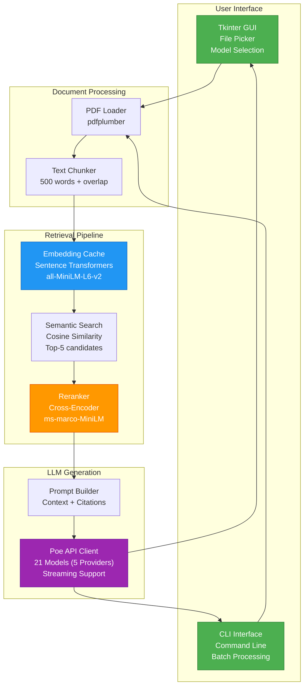
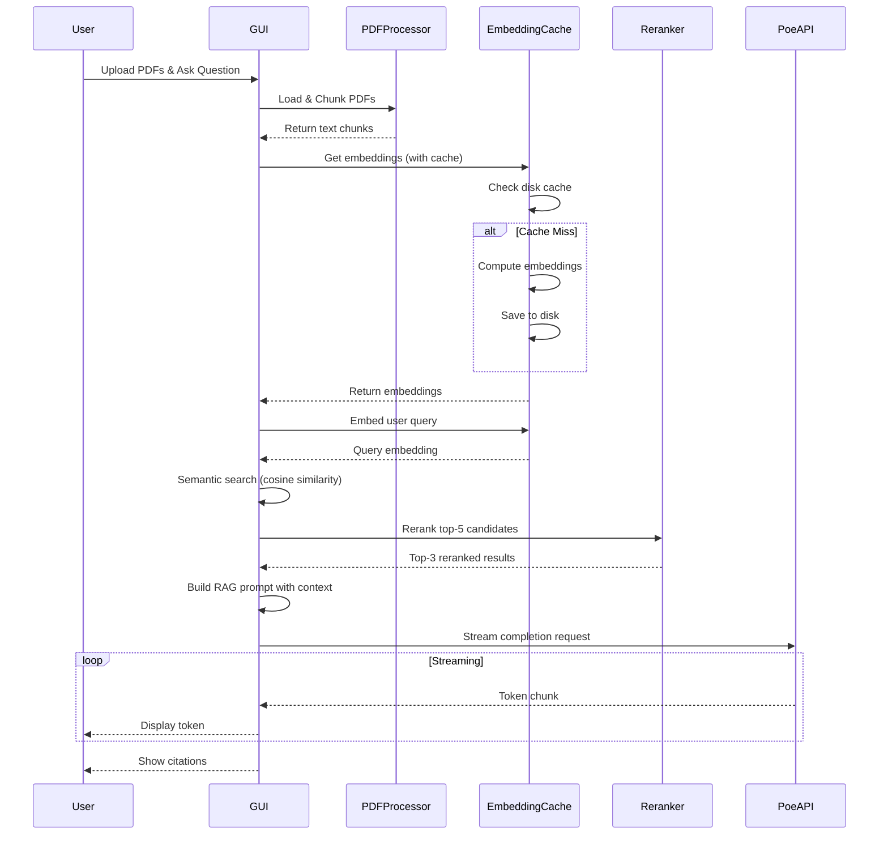

# 🚀 Advanced RAG Pipeline - PDF Q&A System

[](https://www.python.org/downloads/)
[](https://opensource.org/licenses/MIT)
[](https://github.com/psf/black)

A production-ready **Retrieval-Augmented Generation (RAG)** system with a clean Tkinter GUI for intelligent PDF document Q&A. Features semantic search, cross-encoder reranking, streaming responses, and support for multiple LLM models via Poe API.


---

## ✨ Key Features

### 🎯 Core Capabilities
- **🤖 Multi-Model Support**: Choose from 21 LLMs across 5 providers (GPT-5, Claude 4.5, Gemini 2.5, Grok-4, DeepSeek, Qwen, etc.)
- **🔍 Semantic Search**: Sentence Transformers embeddings (384-dim, local inference)
- **🎯 Two-Stage Retrieval**: Initial semantic search → Cross-encoder reranking
- **⚡ Streaming Responses**: Real-time token-by-token output
- **💾 Intelligent Caching**: Persistent embedding cache (3-5x speedup on repeat queries)
- **📚 Multi-PDF Support**: Process and query multiple documents simultaneously
- **🎨 Cross-Platform GUI**: Clean Tkinter interface (Python stdlib, no external dependencies)

### 🛠️ Technical Stack
- **Embeddings**: `all-MiniLM-L6-v2` (local, fast, 384-dim)
- **Reranker**: `ms-marco-MiniLM-L-12-v2` (cross-encoder)
- **LLM API**: Poe API (OpenAI-compatible)
- **PDF Processing**: pdfplumber with intelligent chunking
- **GUI**: Tkinter (Python stdlib, Windows-friendly)

---

## 📊 System Architecture



---

## 📋 Table of Contents

- [Installation](#-installation)
- [Quick Start](#-quick-start)
- [Usage](#-usage)
  - [GUI Mode](#gui-mode)
  - [CLI Mode](#cli-mode)
- [Configuration](#-configuration)
- [Architecture Details](#-architecture-details)
- [API Reference](#-api-reference)
- [Development](#-development)
- [Troubleshooting](#-troubleshooting)
- [Contributing](#-contributing)
- [License](#-license)

---

## 🚀 Installation

### Prerequisites
- Python 3.11 or higher
- 2GB RAM minimum (4GB recommended for multiple PDFs)
- Internet connection (first run downloads ML models ~100MB)

### Option 1: Using `uv` (Recommended)

```powershell
# Windows: First install Visual C++ Redistributable if you haven't
# Download: https://aka.ms/vs/17/release/vc_redist.x64.exe

# Clone the repository
git clone https://github.com/wedsamuel1230/rag-pipeline.git
cd rag-pipeline

# Install uv if not already installed
pip install uv

# Install dependencies
uv sync
```

### Option 2: Using `pip`

```powershell
git clone https://github.com/wedsamuel1230/rag-pipeline.git
cd rag-pipeline
pip install -e .
```

### Set API Key

Get your Poe API key from [poe.com](https://poe.com) and set it:

```powershell
# Windows PowerShell
$env:POE_API_KEY = "your-api-key-here"

# Linux/macOS
export POE_API_KEY="your-api-key-here"
```

---

## ⚡ Quick Start

### Launch GUI

```powershell
python gui_main.py
```

Or if installed with scripts:
```powershell
rag-gui
```

### Quick CLI Test

```powershell
python cli_main.py
```

This will:
1. Load `test-pdf.pdf` (if present)
2. Generate embeddings (cached for next time)
3. Run a demo query
4. Stream the response with citations

---

## 💻 Usage

### GUI Mode

#### 1. **Configure Model**
   - Select your preferred LLM from the dropdown (default: `Assistant`)

#### 2. **Upload PDFs**
   - **Click Add**: Use "➕ Add Files" button to browse
   - **Multi-select**: Select multiple files at once

#### 3. **Process Documents**
   - Click "⚡ Process PDFs"
   - Wait for embedding generation (first time only)
   - Status shows: `✅ Processed X PDF(s) - Y chunks ready`

#### 4. **Ask Questions**
   - Type your question in the text box
   - Click "🚀 Ask Question"
   - Watch the streaming response appear in real-time
   - View source citations at the bottom

#### Example Questions:
- *"Summarize the main points from the documents"*
- *"What does the document say about [topic]?"*
- *"根據 PDF 說明重點並附出處"* (Chinese: Explain key points with sources)

---

### CLI Mode

#### Basic Usage

```powershell
python cli_main.py
```

#### Custom PDF and Query

```powershell
python cli_main.py --pdf=document1.pdf,document2.pdf --query="Your question here"
```

#### Example Output

```
The PDF documents cover a variety of topics related to personal development, workplace dynamics, and psychological resilience. Here are the main points summarized from the retrieved context:

1. **Workplace Dynamics and Personality**:
   - The documents discuss the strengths and weaknesses of individuals in the workplace through the lens of personality types, specifically referencing the Enneagram.
   - They emphasize the importance of understanding one’s interests and professional development, suggesting that individuals can find motivation and values in their careers through "career anchors".

2. **Adversity and Coping Strategies**:
   - There is a focus on the concepts of adversity and stress, highlighting that these elements can affect anyone, regardless of age or socioeconomic status.
   - Events typically seen as positive, like marriage or vacations, can also induce stress and be perceived as adversities.
   - Strategies for coping with adversity and managing stress are discussed, including resilience-building techniques and Rational Emotive Behavior Therapy (REBT).

3. **Current Job Market Analysis**:
   - The documents provide an analysis of the job market in Hong Kong, discussing various factors that impact employment opportunities.

4. **Broader Perspectives on Education and Development**:
   - There is mention of alternative learning pathways to broaden personal educational and career horizons.
   - The importance of understanding oneself and others in the context of employment challenges is also highlighted, suggesting a need for personal insight and social awareness.

5. **Cultural References**:
   - The document includes a reference to a Korean drama titled "Kill Me Heal Me," which tells the story of a protagonist with multiple personalities and his relationship with a psychiatrist, reflecting themes of mental health and personal struggle.

Overall, the documents aim to provide insights into personal and professional development while addressing mental health and societal factors that influence career paths.
```

---

## ⚙️ Configuration

### Model Selection (GUI)

Available models in dropdown (21 models across 5 providers, updated 2025-10-31):

**Poe (1 model)**
- `Assistant` - General-purpose router (default)

**OpenAI (8 models)**
- `GPT-5-Chat` - Latest non-reasoning GPT-5 snapshot
- `GPT-5` - Flagship with improved coding skills
- `GPT-5-Pro` - Enhanced flagship model
- `GPT-5-Codex` - Software engineering specialized
- `GPT-4o` - Natural, engaging writing style
- `GPT-5-mini` - Fast & affordable, beats GPT-4.1
- `GPT-5-nano` - Extremely fast & cheap for summarization
- `o3-pro` - Well-rounded, powerful across domains

**Anthropic (2 models)**
- `Claude-Sonnet-4.5` - Major capability leap forward
- `Claude-Haiku-4.5` - Fastest & most efficient

**Google (2 models)**
- `Gemini-2.5-Pro` - Advanced frontier performance
- `Gemini-2.5-Flash` - Built on 2.0 Flash foundation

**XAI (4 models)**
- `Grok-4` - xAI's most intelligent language model
- `Grok-4-Fast-Reasoning` - Logic & complex problem-solving
- `Grok-4-Fast-Non-Reasoning` - Fast content generation
- `Grok-Code-Fast-1` - High-performance coding

**Others (4 models)**
- `Qwen-3-Next-80B-Think` - Next-gen with thinking mode enabled
- `Qwen3-Next-80B` - Next-gen foundation model
- `DeepSeek-V3.2-Exp` - Experimental model
- `DeepSeek-R1` - Top open-source reasoning LLM

### Token Configuration

Control the maximum tokens for LLM responses:

**GUI:** Adjust the "Max Tokens" spinbox in the Model Selection panel (range: 512-8192, default: 2048)
- Lower values (512-1024): Shorter, faster responses
- Default (2048): Balanced length and quality
- Higher values (4096-8192): Longer, more detailed responses

**CLI/Config:** Edit `MAX_TOKENS` in `src/config.py` to change the default:
```python
MAX_TOKENS = 2048  # Adjust as needed (512-8192)
```

**Note:** Higher token limits increase API costs and response time. Most models support up to 4096-8192 output tokens.

### Advanced Configuration (`src/config.py`)

```python
# LLM Generation
MAX_TOKENS = 2048          # Max tokens for LLM response

# RAG Parameters
CHUNK_SIZE = 500           # Words per chunk
CHUNK_OVERLAP = 50         # Overlap for context continuity
RETRIEVAL_TOP_K = 5        # Initial semantic search candidates
FINAL_TOP_K = 3            # Final results after reranking

# Embedding Configuration
EMBEDDING_MODEL = "all-MiniLM-L6-v2"  # Sentence Transformer model
EMBEDDING_CACHE_DIR = ".embeddings_cache"  # Cache location

# Reranking
RERANKER_MODEL = "cross-encoder/ms-marco-MiniLM-L-12-v2"

# Streaming
STREAM_ENABLED = True      # Enable token-by-token streaming
```

---

## 🏗️ Architecture Details

### Data Flow Diagram



### Project Structure

```
rag-pipeline/
├── src/
│   ├── __init__.py
│   ├── config.py              # Configuration settings
│   ├── core/                  # Core RAG components
│   │   ├── __init__.py
│   │   ├── pdf_processor.py   # PDF loading & chunking
│   │   ├── embeddings.py      # Embedding generation & caching
│   │   ├── reranker.py        # Cross-encoder reranking
│   │   └── retrieval.py       # Semantic search & prompt building
│   └── gui/                   # GUI components
│       ├── __init__.py
│       ├── main_window.py     # Main application window
│       └── widgets.py         # Custom drag-drop widget
├── tests/                     # Test suite
│   ├── test_advanced.py
│   ├── test_integration.py
│   └── ...
├── docs/                      # Documentation
│   └── architecture.md
├── examples/                  # Usage examples
├── gui_main.py               # GUI entry point
├── cli_main.py               # CLI entry point
├── pyproject.toml            # Project metadata
├── README.md                 # This file
└── .gitignore
```

---

## 📖 API Reference

### Core Components

#### `EmbeddingCache`

```python
from src.core import EmbeddingCache

cache = EmbeddingCache()

# Generate embeddings for chunks
embeddings = cache.get_embeddings(chunks)  # Dict[str, np.ndarray]

# Embed a single query
query_emb = cache.embed_text("What is RAG?")  # np.ndarray (384,)
```

#### `Reranker`

```python
from src.core import Reranker

reranker = Reranker()

# Rerank candidates
results = reranker.rerank(
    query="What is RAG?",
    chunks=candidates,
    top_k=3
)  # List[Dict] with 'score' field
```

#### `retrieve_with_reranking`

```python
from src.core import retrieve_with_reranking

results = retrieve_with_reranking(
    query="Your question",
    chunks=all_chunks,
    embedding_cache=cache,
    reranker=reranker,
    top_k=3
)
```

---

## 🛠️ Development

### Running Tests

```powershell
# Run all tests
pytest tests/

# Run specific test file
pytest tests/test_advanced.py

# With coverage
pytest --cov=src tests/
```

### Code Formatting

```powershell
# Format code
black src/ tests/

# Check types
mypy src/

# Lint
flake8 src/
```

### Building Documentation

```powershell
cd docs
make html
```

---

## 🐛 Troubleshooting

### Issue: Windows DLL Error (PyTorch c10.dll)

**Error Message:**
```
OSError: [WinError 1114] Error loading "c10.dll" or one of its dependencies.
```

**Solution:**
Install Microsoft Visual C++ Redistributable:
1. Download: [vc_redist.x64.exe](https://aka.ms/vs/17/release/vc_redist.x64.exe)
2. Run the installer
3. Restart your terminal
4. Try running the application again

This is required for PyTorch to work on Windows.

### Issue: "POE_API_KEY not set"

**Solution:**
```powershell
$env:POE_API_KEY = "your-key"
```

Make it permanent by adding to PowerShell profile:
```powershell
notepad $PROFILE
# Add: $env:POE_API_KEY = "your-key"
```

### Issue: Slow first run

**Expected**: First run downloads ML models (~100MB). Subsequent runs use cache and are 3-5x faster.

### Issue: Out of memory with large PDFs

**Solution:** Reduce `CHUNK_SIZE` or `RETRIEVAL_TOP_K` in `src/config.py`

---

## 🤝 Contributing

Contributions are welcome! Please see [CONTRIBUTING.md](CONTRIBUTING.md) for guidelines.

### Development Workflow

1. Fork the repository
2. Create a feature branch: `git checkout -b feature/amazing-feature`
3. Make your changes
4. Run tests: `pytest tests/`
5. Commit: `git commit -m 'Add amazing feature'`
6. Push: `git push origin feature/amazing-feature`
7. Open a Pull Request

---

## 📄 License

This project is licensed under the MIT License - see the [LICENSE](LICENSE) file for details.

---

## 🙏 Acknowledgments

- **Sentence Transformers**: For excellent embedding models
- **OpenAI/Poe**: For powerful LLM APIs
- **Tkinter**: Python's built-in GUI framework
- **pdfplumber**: For reliable PDF text extraction

---

## 📞 Contact

- **Author**: wed
- **Email**: wedsamuel1230@gmail.com
- **GitHub**: [@wedsamuel1230](https://github.com/wedsamuel1230)
- **Issues**: [GitHub Issues](https://github.com/wedsamuel1230/rag-pipeline/issues)

---

## ⭐ Star History

If you find this project useful, please consider giving it a star! ⭐

[](https://star-history.com/#wedsamuel1230/rag-pipeline&Date)

---

<div align="center">

[Report Bug](https://github.com/wedsamuel1230/rag-pipeline/issues) · [Request Feature](https://github.com/wedsamuel1230/rag-pipeline/issues) · [Documentation](https://github.com/wedsamuel1230 /rag-pipeline/wiki)

</div>
