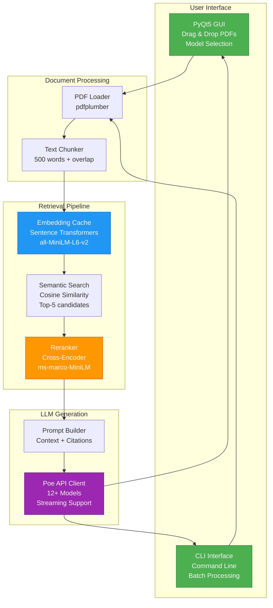

# 🚀 Advanced RAG Pipeline - PDF Q&A System

[](https://www.python.org/downloads/)
[](https://opensource.org/licenses/MIT)
[](https://github.com/psf/black)

A production-ready **Retrieval-Augmented Generation (RAG)** system with a professional PyQt5 GUI for intelligent PDF document Q&A. Features semantic search, cross-encoder reranking, streaming responses, and support for multiple LLM models via Poe API.


---

## ✨ Key Features

### 🎯 Core Capabilities
- **🤖 Multi-Model Support**: Choose from 12+ LLMs (GPT-4o, Claude 3.5, Gemini, Llama, etc.)
- **📄 Drag-and-Drop PDF Upload**: Intuitive GUI with file management
- **🔍 Semantic Search**: Sentence Transformers embeddings (384-dim, local inference)
- **🎯 Two-Stage Retrieval**: Initial semantic search → Cross-encoder reranking
- **⚡ Streaming Responses**: Real-time token-by-token output
- **💾 Intelligent Caching**: Persistent embedding cache (3-5x speedup on repeat queries)
- **📚 Multi-PDF Support**: Process and query multiple documents simultaneously
- **🎨 Professional GUI**: Modern PyQt5 interface with dark mode support

### 🛠️ Technical Stack
- **Embeddings**: `all-MiniLM-L6-v2` (local, fast, 384-dim)
- **Reranker**: `ms-marco-MiniLM-L-12-v2` (cross-encoder)
- **LLM API**: Poe API (OpenAI-compatible)
- **PDF Processing**: pdfplumber with intelligent chunking
- **GUI**: PyQt5 with custom drag-drop widgets

---

## 📊 System Architecture



---

## 📋 Table of Contents

- [Installation](#-installation)
- [Quick Start](#-quick-start)
- [Usage](#-usage)
  - [GUI Mode](#gui-mode)
  - [CLI Mode](#cli-mode)
- [Configuration](#-configuration)
- [Architecture Details](#-architecture-details)
- [API Reference](#-api-reference)
- [Development](#-development)
- [Troubleshooting](#-troubleshooting)
- [Contributing](#-contributing)
- [License](#-license)

---

## 🚀 Installation

### Prerequisites
- Python 3.11 or higher
- 2GB RAM minimum (4GB recommended for multiple PDFs)
- Internet connection (first run downloads ML models ~100MB)
- **Windows Users**: [Microsoft Visual C++ Redistributable](https://aka.ms/vs/17/release/vc_redist.x64.exe) (required for PyTorch)

### Option 1: Using `uv` (Recommended)

```powershell
# Windows: First install Visual C++ Redistributable if you haven't
# Download: https://aka.ms/vs/17/release/vc_redist.x64.exe

# Clone the repository
git clone https://github.com/yourusername/rag-pipeline.git
cd rag-pipeline

# Install uv if not already installed
pip install uv

# Install dependencies
uv sync
```

### Option 2: Using `pip`

```powershell
git clone https://github.com/yourusername/rag-pipeline.git
cd rag-pipeline
pip install -e .
```

### Set API Key

Get your Poe API key from [poe.com](https://poe.com) and set it:

```powershell
# Windows PowerShell
$env:POE_API_KEY = "your-api-key-here"

# Linux/macOS
export POE_API_KEY="your-api-key-here"
```

---

## ⚡ Quick Start

### Launch GUI

```powershell
python gui_main.py
```

Or if installed with scripts:
```powershell
rag-gui
```

### Quick CLI Test

```powershell
python cli_main.py
```

This will:
1. Load `test-pdf.pdf` (if present)
2. Generate embeddings (cached for next time)
3. Run a demo query
4. Stream the response with citations

---

## 💻 Usage

### GUI Mode

#### 1. **Configure Model**
   - Select your preferred LLM from the dropdown (default: `gpt-4o-mini`)
   - Check API key status indicator (✅ green = ready)

#### 2. **Upload PDFs**
   - **Drag & Drop**: Drag PDF files into the drop zone
   - **Click Add**: Use "➕ Add Files" button to browse
   - **Multi-select**: Select multiple files at once

#### 3. **Process Documents**
   - Click "⚡ Process PDFs"
   - Wait for embedding generation (first time only)
   - Status shows: `✅ Processed X PDF(s) - Y chunks ready`

#### 4. **Ask Questions**
   - Type your question in the text box
   - Click "🚀 Ask Question"
   - Watch the streaming response appear in real-time
   - View source citations at the bottom

#### Example Questions:
- *"Summarize the main points from the documents"*
- *"What does the document say about [topic]?"*
- *"根據 PDF 說明重點並附出處"* (Chinese: Explain key points with sources)

---

### CLI Mode

#### Basic Usage

```powershell
python cli_main.py
```

#### Custom PDF and Query

```powershell
python cli_main.py --pdf=document1.pdf,document2.pdf --query="Your question here"
```

#### Example Output

```
🚀 Advanced RAG Pipeline with Embeddings, Reranking & Streaming
======================================================================

📄 Loading 1 PDF(s)...
✓ Extracted 28 chunks total

❓ Query: Explain the main points from the PDF with sources.

🔍 Retrieving relevant documents...
✓ Retrieved 3 relevant chunks

💬 Querying Poe API (streaming)...

======================================================================
RESPONSE:
======================================================================
Based on the PDF documents, the main points are:

1. [Content streams here in real-time...]

======================================================================
📚 SOURCE CITATIONS:
======================================================================
  [1] document.pdf, Page 3
  [2] document.pdf, Page 7
  [3] document.pdf, Page 12
======================================================================
```

---

## ⚙️ Configuration

### Model Selection (GUI)

Available models in dropdown:
- **GPT Models**: `gpt-4o-mini`, `gpt-4o`, `gpt-3.5-turbo`
- **Claude**: `claude-3.5-sonnet`, `claude-3-opus`, `claude-3-haiku`
- **Gemini**: `gemini-2.0-flash-exp`, `gemini-pro`
- **Llama**: `llama-3.3-70b`, `llama-3.1-405b`
- **Others**: `mistral-large`, `qwen-2.5-72b`

### Advanced Configuration (`src/config.py`)

```python
# RAG Parameters
CHUNK_SIZE = 500           # Words per chunk
CHUNK_OVERLAP = 50         # Overlap for context continuity
RETRIEVAL_TOP_K = 5        # Initial semantic search candidates
FINAL_TOP_K = 3            # Final results after reranking

# Embedding Configuration
EMBEDDING_MODEL = "all-MiniLM-L6-v2"  # Sentence Transformer model
EMBEDDING_CACHE_DIR = ".embeddings_cache"  # Cache location

# Reranking
RERANKER_MODEL = "cross-encoder/ms-marco-MiniLM-L-12-v2"

# Streaming
STREAM_ENABLED = True      # Enable token-by-token streaming
```

---

## 🏗️ Architecture Details

### Data Flow Diagram


### Project Structure

```
rag-pipeline/
├── src/
│   ├── __init__.py
│   ├── config.py              # Configuration settings
│   ├── core/                  # Core RAG components
│   │   ├── __init__.py
│   │   ├── pdf_processor.py   # PDF loading & chunking
│   │   ├── embeddings.py      # Embedding generation & caching
│   │   ├── reranker.py        # Cross-encoder reranking
│   │   └── retrieval.py       # Semantic search & prompt building
│   └── gui/                   # GUI components
│       ├── __init__.py
│       ├── main_window.py     # Main application window
│       └── widgets.py         # Custom drag-drop widget
├── tests/                     # Test suite
│   ├── test_advanced.py
│   ├── test_integration.py
│   └── ...
├── docs/                      # Documentation
│   └── architecture.md
├── examples/                  # Usage examples
├── gui_main.py               # GUI entry point
├── cli_main.py               # CLI entry point
├── pyproject.toml            # Project metadata
├── README.md                 # This file
└── .gitignore
```

---

## 📖 API Reference

### Core Components

#### `EmbeddingCache`

```python
from src.core import EmbeddingCache

cache = EmbeddingCache()

# Generate embeddings for chunks
embeddings = cache.get_embeddings(chunks)  # Dict[str, np.ndarray]

# Embed a single query
query_emb = cache.embed_text("What is RAG?")  # np.ndarray (384,)
```

#### `Reranker`

```python
from src.core import Reranker

reranker = Reranker()

# Rerank candidates
results = reranker.rerank(
    query="What is RAG?",
    chunks=candidates,
    top_k=3
)  # List[Dict] with 'score' field
```

#### `retrieve_with_reranking`

```python
from src.core import retrieve_with_reranking

results = retrieve_with_reranking(
    query="Your question",
    chunks=all_chunks,
    embedding_cache=cache,
    reranker=reranker,
    top_k=3
)
```

---

## 🛠️ Development

### Running Tests

```powershell
# Run all tests
pytest tests/

# Run specific test file
pytest tests/test_advanced.py

# With coverage
pytest --cov=src tests/
```

### Code Formatting

```powershell
# Format code
black src/ tests/

# Check types
mypy src/

# Lint
flake8 src/
```

### Building Documentation

```powershell
cd docs
make html
```

---

## 🐛 Troubleshooting

### Issue: Windows DLL Error (PyTorch c10.dll)

**Error Message:**
```
OSError: [WinError 1114] Error loading "c10.dll" or one of its dependencies.
```

**Solution:**
Install Microsoft Visual C++ Redistributable:
1. Download: [vc_redist.x64.exe](https://aka.ms/vs/17/release/vc_redist.x64.exe)
2. Run the installer
3. Restart your terminal
4. Try running the application again

This is required for PyTorch to work on Windows.

### Issue: "POE_API_KEY not set"

**Solution:**
```powershell
$env:POE_API_KEY = "your-key"
```

Make it permanent by adding to PowerShell profile:
```powershell
notepad $PROFILE
# Add: $env:POE_API_KEY = "your-key"
```

### Issue: "Import PyQt5 could not be resolved"

**Solution:**
```powershell
pip install PyQt5
# Or with uv:
uv pip install PyQt5
```

### Issue: Slow first run

**Expected**: First run downloads ML models (~100MB). Subsequent runs use cache and are 3-5x faster.

### Issue: Out of memory with large PDFs

**Solution:** Reduce `CHUNK_SIZE` or `RETRIEVAL_TOP_K` in `src/config.py`

---

## 🤝 Contributing

Contributions are welcome! Please see [CONTRIBUTING.md](CONTRIBUTING.md) for guidelines.

### Development Workflow

1. Fork the repository
2. Create a feature branch: `git checkout -b feature/amazing-feature`
3. Make your changes
4. Run tests: `pytest tests/`
5. Commit: `git commit -m 'Add amazing feature'`
6. Push: `git push origin feature/amazing-feature`
7. Open a Pull Request

---

## 📄 License

This project is licensed under the MIT License - see the [LICENSE](LICENSE) file for details.

---

## 🙏 Acknowledgments

- **Sentence Transformers**: For excellent embedding models
- **OpenAI/Poe**: For powerful LLM APIs
- **PyQt5**: For robust GUI framework
- **pdfplumber**: For reliable PDF text extraction

---

## 📞 Contact

- **Author**: Your Name
- **Email**: your.email@example.com
- **GitHub**: [@yourusername](https://github.com/yourusername)
- **Issues**: [GitHub Issues](https://github.com/yourusername/rag-pipeline/issues)

---

## ⭐ Star History

If you find this project useful, please consider giving it a star! ⭐

[](https://star-history.com/#yourusername/rag-pipeline&Date)

---

<div align="center">

**Made with ❤️ by the RAG Pipeline Team**

[Report Bug](https://github.com/yourusername/rag-pipeline/issues) · [Request Feature](https://github.com/yourusername/rag-pipeline/issues) · [Documentation](https://github.com/yourusername/rag-pipeline/wiki)

</div>
