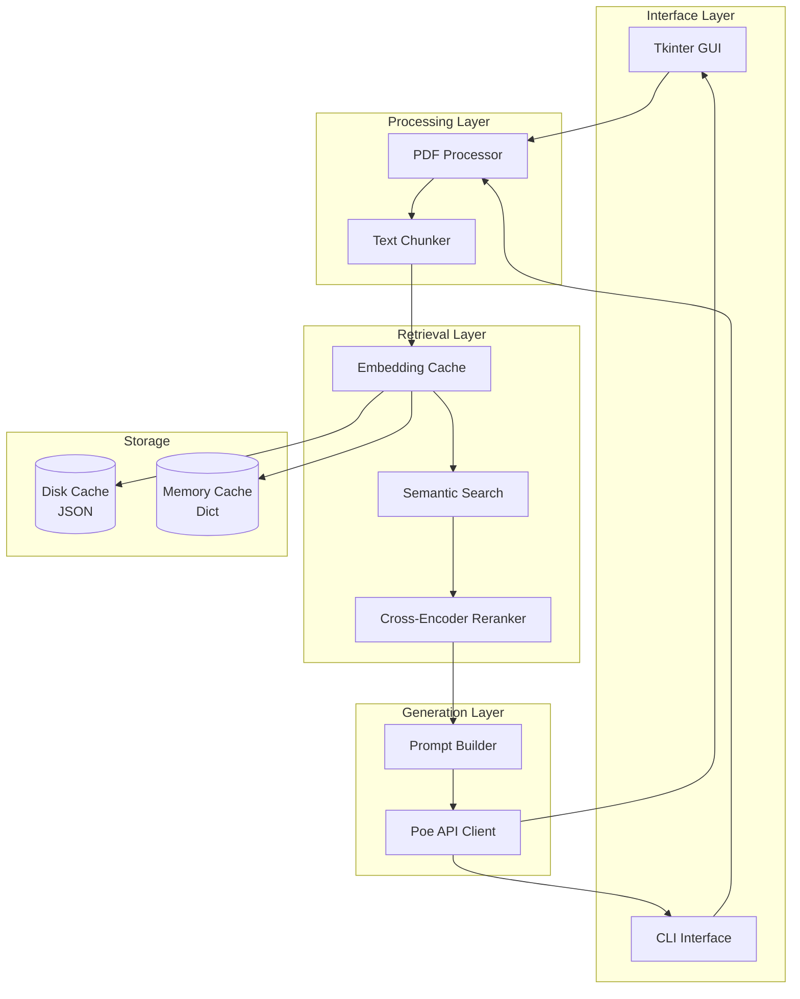

# System Architecture

## Overview

The Advanced RAG Pipeline is built on a modular architecture that separates concerns into distinct layers: interface, processing, retrieval, and generation.

## Component Architecture

## Data Flow

### Document Processing Pipeline

1. **PDF Loading**: pdfplumber extracts text page by page
2. **Chunking**: Text split into ~500 word chunks with 50 word overlap
3. **Embedding**: Sentence Transformer generates 384-dim vectors
4. **Caching**: Embeddings saved to JSON files per PDF

### Query Processing Pipeline

1. **Query Embedding**: User question → 384-dim vector
2. **Semantic Search**: Cosine similarity → Top 5 candidates
3. **Reranking**: Cross-encoder scores → Top 3 final results
4. **Prompt Building**: Context + citations + user query
5. **LLM Generation**: Streaming response from Poe API

## Key Design Decisions

### Why Two-Stage Retrieval?

- **Stage 1 (Semantic Search)**: Fast, approximate matching using embeddings
- **Stage 2 (Reranking)**: Precise scoring with cross-encoder

This balances **speed** (semantic search is O(n) with vectors) and **accuracy** (cross-encoder is more precise but slower).

### Why Local Embeddings?

- No API costs for embedding generation
- Faster after initial model download
- Privacy: documents never leave your machine
- Caching provides 3-5x speedup on repeat queries

### Why Tkinter for GUI?

- Python stdlib (no external dependencies)
- Zero binary wheel issues on Windows
- Lightweight and fast startup
- Cross-platform (Windows, macOS, Linux)
- Simple maintenance and deployment

## Performance Characteristics

| Operation | First Run | Cached |
|-----------|-----------|--------|
| Load embeddings model | ~5s | <0.1s |
| Embed 100 chunks | ~2s | <0.1s |
| Semantic search | ~0.05s | ~0.05s |
| Reranking (5→3) | ~0.2s | ~0.2s |
| LLM streaming | Depends on API | Depends on API |

## Scalability Considerations

### Current Limits
- **PDF Size**: Up to ~100 pages per document (limited by memory)
- **Concurrent Queries**: Single-threaded (GUI limitation)
- **Cache Size**: Unlimited (disk-based)

### Future Improvements
- Vector database integration (Pinecone, Weaviate)
- Batch processing for large PDF collections
- Multi-threaded query processing
- Distributed caching (Redis)

## Security Model

### API Keys
- Stored in environment variables
- Never logged or displayed
- GUI shows only status (✅/❌)

### PDF Processing
- All processing happens locally
- PDFs never uploaded to external services
- Only final prompts sent to LLM API

### Caching
- Embeddings cached locally in `.embeddings_cache/`
- No sensitive content stored (only vectors)
- Cache can be safely shared across machines for same PDFs

## Extension Points

### Adding New LLM Providers

1. Create new client in `src/core/llm_clients/`
2. Implement `BaseLLMClient` interface
3. Add to GUI model dropdown

### Adding New Embedding Models

1. Update `EMBEDDING_MODEL` in `config.py`
2. Model auto-downloads from HuggingFace
3. Adjust `EMBEDDING_DIM` if different

### Custom Rerankers

1. Implement `BaseReranker` interface
2. Update `Reranker` class in `src/core/reranker.py`
3. Configure in `config.py`

## Technology Choices

| Component | Technology | Rationale |
|-----------|-----------|-----------|
| GUI | Tkinter | Python stdlib, zero dependencies, Windows-friendly |
| Embeddings | Sentence Transformers | Local, fast, good quality |
| Reranking | Cross-Encoder | State-of-art for passage reranking |
| PDF | pdfplumber | Reliable text extraction |
| API | Poe (OpenAI-compatible) | Access to 12+ LLMs, streaming |
| Packaging | pyproject.toml | Modern Python standard |

---

For implementation details, see individual module documentation in `src/core/`.
